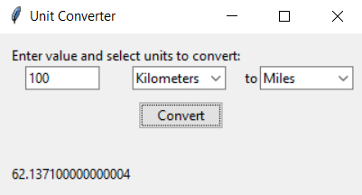

# Unit Converter

A basic and user-friendly graphical unit converter built with Python and Tkinter.

 
<!-- You can replace `screenshot.png` with an actual screenshot of the application if you wish -->

## Features:
- Convert between kilometers, miles, and meters.
- Simple and intuitive GUI.
- Quick conversion with immediate results.

## Installation:

### Prerequisites:
- Python 3.x
- Tkinter (usually comes bundled with Python)

### Steps:
1. Clone the repository:
   ```bash
   git clone https://github.com/YourUsername/unit-converter.git

# Navigate to the cloned directory:

cd Unit Converter

# Run the application:

python unit_converter.py


# Usage:

Enter the value you want to convert in the input field.
Select the source unit from the first dropdown.
Select the target unit from the second dropdown.
Click the "Convert" button.
View the converted value below the button.

# Contributing:

Pull requests are welcome. For major changes, please open an issue first to discuss what you would like to change.

Please make sure to update tests as appropriate.


---

You can modify the `README.md` as per your needs, especially the repository URL and the screenshot placeholder. If you decide to add a screenshot, simply replace `screenshot.png` with the path to your screenshot.
